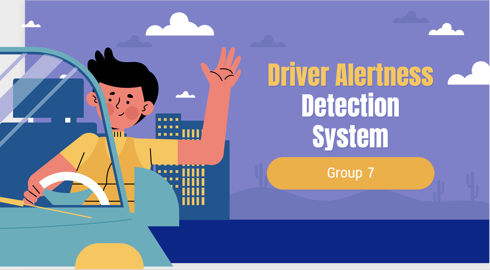

## SECTION 1 : PRS-PM-2022-07-02-ISY5002-GROUP_7
## Driver Alertness Detection System

---

## SECTION 2 : EXECUTIVE SUMMARY / PAPER ABSTRACT
This project intends to build a complete working prototype for a driver alertness detection system with the aim of improving the safety of drivers on the road. As covered in the ISSM module, this is an end-to-end Intelligent Pattern Recognition and Sense Making System implementation. Below is a pipeline of system implementation, with explanations on how our project components fit into each bucket.

---

## SECTION 3 : CREDITS / PROJECT CONTRIBUTION

| Official Full Name  | Student ID (MTech Applicable)  |  Email (Optional) |
| :------------ |:---------------:| :-----|
| Hwang Sion | A0249263Y |  e0938868@u.nus.edu |
| Prerak Agarwal | A0116711R |  e0938637@u.nus.edu |
| Santi- | A0249294R |  e0938899@u.nus.edu |
| Zhang Junfeng | A0249266U |  junfeng@u.nus.edu |

---

## SECTION 4 : VIDEO OF SYSTEM MODELLING & USE CASE DEMO

System technical design explanation:

https://https://github.com/SionsML/PRS-PM-2022-07-02-ISY5002-GROUP_7

---

## SECTION 5 : USER GUIDE

`Refer to "User Manual.pdf" in project report folder at Github Folder: ProjectReport`

The document will contain below infromation

### [ 1 ] App User Manual

### [ 2 ] APK installation & build

### [ 3 ] Engine installation & build

---
## SECTION 6 : PROJECT REPORT / PAPER

`Refer to project report at Github Folder: ProjectReport`

---
## SECTION 7 : MISCELLANEOUS

`Refer to Github Folder: Miscellaneous`

### Data

### Data Preparation

---
